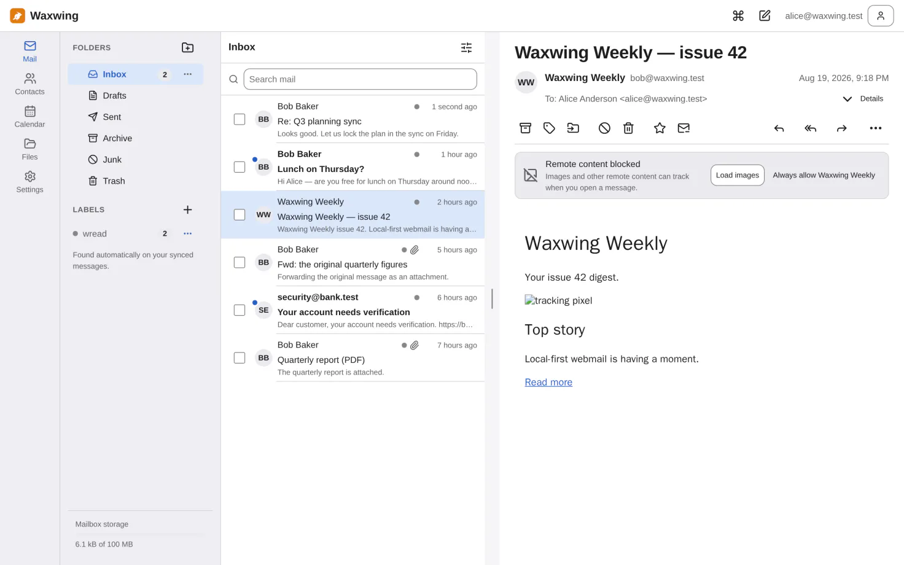

<p align="center">
  
</p>

<h1 align="center">Waxwing</h1>

<p align="center"><b>A serverless webmail client for JMAP.</b><br/>
Just static files and your mail server — no middleware, no database, no container.</p>

<p align="center">
  <a href="https://github.com/Heiko-W/waxwing/actions/workflows/ci.yml"></a>
  <a href="LICENSE"></a>
</p>

<p align="center">
  
</p>

---

Waxwing is a modern, minimalist webmail client that runs entirely in the browser and talks
directly to a JMAP mail server such as [Stalwart](https://stalw.art) — over HTTPS, with live
updates on an SSE stream. It ships as plain static files: Stalwart can host it itself (via its
*Applications* feature), or you serve it from any web server or CDN. Installable as a
Progressive Web App with real push notifications, offline reading, and an offline outbox.

> The waxwing is named for the sealing-wax-red tips of its wing feathers — the bird that
> carries a wax seal. Silky plumage, no excess, letters delivered sealed: that's the brand.

## Why

Classic webmail (Roundcube & friends) needs its own server-side stack because IMAP was
never meant for browsers. JMAP is: JSON over HTTPS, parsed and indexed by the mail
server. That makes the extra webmail server obsolete — Waxwing is the client that follows
through on that idea.

## Install it

Stalwart can host Waxwing itself and keep it updated. One command, and it is done:

```sh
curl -u 'admin:PASSWORD' -X POST https://mail.example.com/jmap/ \
  -H 'Content-Type: application/json' \
  -d '{
    "using": ["urn:ietf:params:jmap:core"],
    "methodCalls": [["x:Application/set", {
      "create": {
        "waxwing": {
          "enabled": true,
          "description": "Waxwing webmail",
          "resourceUrl": "https://github.com/Heiko-W/waxwing/releases/latest/download/waxwing-stalwart.zip",
          "urlPrefix": { "/webmail": true },
          "autoUpdateFrequency": 604800000
        }
      }
    }, "c1"]]
  }'
```

Restart Stalwart and open `https://mail.example.com/webmail/`. That is the whole installation:
no web server to run, no container, no database.

`autoUpdateFrequency` makes Stalwart re-fetch the release weekly, so new versions arrive on
their own. Say plainly what that means: it is a standing decision to run whatever this project
publishes next, in your users' browsers, against their mailboxes. If you would rather not,
point `resourceUrl` at a versioned asset and drop the field — then upgrading is deliberate, and
you can check what you are upgrading to:

```sh
sha256sum -c SHA256SUMS --ignore-missing                       # arrived intact
gh attestation verify waxwing-stalwart.zip --repo Heiko-W/waxwing \
  --source-ref refs/tags/v0.15.0                               # built here, from THAT TAG
```

`--ignore-missing` because `SHA256SUMS` lists all three artefacts and you downloaded one;
without it the command fails on the two you did not fetch. `--source-ref` because without it
the check also passes for a build from any branch of this repository — including the rehearsal
builds the release workflow makes on purpose. Name the tag you are installing.

The [deployment guide](docs/deployment.md#verifying-what-you-installed) has both forms, and
[`SECURITY.md`](SECURITY.md) §4 says what each check does and does not cover.

Not using Stalwart, or want it behind your own nginx? Two more paths — and the honest
trade-off of the cross-origin one — are in the **[deployment guide](docs/deployment.md)**.

## What it does

- **Mail** — conversations, a virtualized list that stays smooth at 100 000 messages, full-text
  search, labels, and triage that works entirely from the keyboard
- **Compose** — rich text (Fastmail's Squire), draft autosave, attachments, undo send, and
  identities you can actually manage: add, edit or delete a send address and its signature
- **Contacts** — JMAP for Contacts (RFC 9610) address books, groups, composer autocomplete
- **Filters** — server-side rules over JMAP for Sieve (RFC 9661), so they keep sorting your mail
  while the app is closed. A script you already had is preserved untouched, never rewritten
- **Live** — push over EventSource (SSE), system notifications via Web Push
- **Offline** — a local replica, an outbox that survives a reload and a reconnect, installable as a PWA
- **Private** — remote content blocked by default, message bodies rendered in a script-free
  sandboxed frame, zero telemetry
- **Yours** — minimalist design, dark/light, white-label through `config.json` + `theme.css`
  with no rebuild
- **In your language** — 14 of them: Čeština, Deutsch, English, Español, Français, Italiano,
  Nederlands, Polski, Português, Türkçe, Русский, Українська, 中文, 日本語. Only the first two
  have been read by a native speaker — [see below](#the-translations-need-you)

## Status

**v0.20.0 — feature-complete, and deliberately not 1.0 yet.**

Every planned work package is done and the release gate is signed off: 5 191 unit tests, 20
integration tests against a live Stalwart, and 246 end-to-end tests across the **seven** Playwright
suites the gate runs. The seventh is WebKit, which used to run beside the gate rather than in it —
see below. Performance and accessibility are measured rather than asserted — the numbers are in the
[implementation plan](docs/implementation-plan.md).

**v0.20.0 is the §13 finding list, worked to the end** — ten `Bxx` findings fixed, three closed as
accepted trade-offs, one left open on the owner's decision.

Three of them were not tidying:

- **A folder could be emptied and never recover (B17).** Filed UNPROVEN for a month, reproduced
  against the live fixture: Stalwart honours `upToId` in deciding *which* changes to report and
  numbers the additions against the whole result set, so an "unread first" window of 50 over 120
  messages answers `removed: 50, added: 50` with every addition at index 70–119. The client dropped
  all fifty and wrote the window back **empty**, with a carried-over total and a *live* query state —
  and only a *voided* window is ever re-queried. The folder would have shown nothing, online,
  indefinitely. An addition that cannot be placed now means "this delta cannot be applied", which is
  what `cannotCalculateChanges` already means.
- **Every mailbox consumer had its own subscription (B10, [ADR-035](docs/adr/035-one-mailbox-subscription-for-the-whole-app.md)).**
  Twenty-nine of them, resolving on their own ticks. Demonstrated rather than argued: with the
  reveal layer already re-rendered without Archive, `e` still dispatched a move *into* the mailbox
  that had just been deleted. One shared subscription now — which also removed an accident another
  component was quietly living on, and is the more interesting half of that story.
- **The message body frame is a tab stop and nothing said so (B6).** Found by a new browser-side
  focus sweep on its first run. Across the iframe boundary there is nothing to hang a CSS rule on:
  with focus in the frame the `<iframe>` matches neither `:focus`, `:focus-visible` nor
  `:focus-within` and fires no focus event, while the framed document reports `hasFocus()`.

**Four security questions, answered by experiment rather than by argument (B25).** The app's CSP
*does* bind inside the mail frame — the intersection of the two policies applies, which
`csp.shipped.test.ts` has reasoned from for two milestones without anything ever measuring it. Five
namespace-confusion payloads pasted through the real paste path leave nothing behind. And a JMAP
navigation cannot reach the service worker under a `/mail/` mount, because scope decides that, not
the denylist.

**WebKit is in the gate now (B11).** It used to be four smoke tests run by hand; it runs the whole
read suite — the sanitizer, the reading pane, the split pane, the message list — on the one engine
whose disagreements have actually cost this project defects. One test is skipped there with the
reason at the skip ([ADR-029](docs/adr/029-safari-cannot-intercept-clicks-in-a-sandboxed-frame.md)).

**Three findings are closed as accepted rather than fixed**, each with the condition under which it
would be re-opened: an inexact window retraction whose exact form needs a versioned undo payload
(B14), a void gate that is deliberately not filter-aware because over-voiding costs a round trip and
under-voiding costs a wrong list (B15), and a count patch that is not re-applied for an intent the
server may already have processed, because a double-count never self-corrects (B18).

**One stays open**: content in a push notification while the app is closed (B28) would move the
access token, the `SecretStore` and the OAuth refresh into the service worker. Nothing of that is
there today, and that is what NFR-SEC-02 promises. Post-V1, on the owner's decision.

**v0.19.0 is Waxwing read against Apple's Human Interface Guidelines** — 39 findings for the
desktop, the tablet and the phone, all of them worked off
([the survey](docs/hig-audit-2026-08-24/README.md)).

Full conformance was never the goal, and the audit says so on its first page: this is a web app
that also runs on Windows, Linux and Android, and part of the HIG presupposes a system menu bar,
window traffic lights and real vibrancy materials. What transfers is the other part — and it turned
out to be the larger one. Every finding carries a verdict of *adopt*, *adapt* or *deliberately
differ*; the third category came out empty, which is itself a result.

Five causes produced twelve of the findings:

- **`color-scheme` was declared nowhere.** The tokens could paint the app dark; the parts the
  *browser* draws stayed light — scrollbars, the open list of every native `<select>` (a system
  popover on an iPad), date fields, the selection highlight.
- **The blanket reduced-motion reset froze every progress indicator.**
  `animation-iteration-count: 1` for *everything* meant the spinner turned once in a hundredth of a
  millisecond and then stood still: the app told its reader "stalled" with the very mark that means
  "working". WCAG 2.3.3 asks for reduced motion, not for none.
- **`visualViewport` appeared zero times.** Send, Discard and every dialog footer sat under the
  on-screen keyboard — the primary action of this app's central task, invisible for as long as
  someone was typing.
- **One of four safe-area insets was read**, under `viewport-fit=cover` and `display: standalone`.
  The phone header — which carries the entire mail chrome on that viewport — padded 8 px against
  the Dynamic Island.
- **Form dialogs threw typed input away** on Escape and on a press beside them. On a 390 px phone
  that backdrop is not a thin margin; it is where a thumb lands reaching for the keyboard.

Plus context menus on four surfaces, ⌘Z for undo, grouped menus with separators, a folder rail that
can be put away and stays away, a split whose width is a share of the room rather than a per-tier
constant, an action bar docked in the thumb zone on a phone, and keyboard semantics for address
fields.

Two findings are **decided rather than fixed**, each with an ADR: the PWA launch screen cannot
follow the system appearance because the manifest holds one `background_color` and no media-query
mechanism ([ADR-033](docs/adr/033-the-pwa-launch-screen-cannot-follow-the-system-theme.md)), and
upload progress is not available behind the `fetch` seam
([ADR-034](docs/adr/034-upload-progress-is-not-available-behind-the-fetch-seam.md)).

**What the checks are for.** Every one of those defects is invisible on a developer's machine, so
the round leaves five new static guards behind — `color-scheme` per theme block, `env(safe-area-*)`
only in `tokens.css` (the inset is *physical*, so a hand-written rule pads the wrong edge under
RTL), an explicit variant on every `<Button>`, the first test `layout.ts` has ever had, and the
contrast matrix over four palettes instead of two.

**And what only looking found.** A visual sweep at 390 / 834 / 1280 px against the live fixture
caught a defect six passing assertions could not: the header reported *"Updated in 9 seconds"* — a
time in the future, for a minute after every sync. The clock was read when the shell mounted and
kept in state; every test asked about "3 minutes ago", and the sign only flips in the first moment.

**v0.18.0 is the folder rail, read from two screenshots of the running deployment.** With three
accounts in it the rail was one long column of near-identical folder names, and the top-level
navigation spent 96 px repeating what its icons already said:

- **An account folds away, and stays folded.** The header row is the control; the state is stored
  per device, so it survives a reload. A folded account keeps its Inbox unread count on its header —
  folding must not hide the one thing about an account that is time-sensitive.
- **A bracket down each section's leading edge**, accented for the account whose mail is on screen.
  Continuous on purpose: a header answers "whose folders are these" only until it scrolls away.
- **The scrollbar was drawn in pieces, and only on macOS.** The rail has exactly one scroll
  container, so the reported gaps could not be two scrollbars — they line up with the account
  headers, which are opaque and carry a `z-index`, and a stacking context is what gets painted over
  an *overlay* scrollbar. It cannot happen where the bar has its own gutter, which is why no suite
  here could have seen it: they all run Chromium on Linux. The app now measures the platform's real
  scrollbar at boot and reserves a lane only where one is needed.
- **The navigation gave back 43 px** — icons at 53 px on a desktop and 61 px on a touch tablet,
  against 96 px before, with the touch target intact. The label is kept for screen readers and shown
  as a tooltip, and the phone's bottom bar still prints it.

**The flake that came with it was two test defects, and neither was in the app.** One assertion
counted a list before it had arrived and then waited five seconds for a correct icon to disappear;
another aimed a click by hovering, in a rail that moves when a share notice arrives. Sixteen
consecutive runs of the suite passed afterwards, and CI recorded no retries for the first time since
v0.17.0. A third instance of the same class turned up in the test written to prove the first fix —
recorded, with the rule it produced: if a value crosses a store, a database or the network, wait for
it.

**v0.17.0 is what the traces found.** Six end-to-end suites had been failing intermittently for
months and it was being read as flakiness. It was not. Recording what actually went over the wire —
rather than reasoning about the code — turned the same symptom into five separate defects, four of
them in the app:

- **A folder showed only the last 30 days of itself.** One setting governed two different horizons:
  how much mail the device *keeps* offline, and how much a folder *shows*. Opening a folder of older
  mail said "No messages from the last 30 days" beside a sidebar listing it as a normal folder. The
  cache window now bounds only what is kept
  ([ADR-030](docs/adr/030-a-folder-shows-the-folder-not-a-30-day-window.md)).
- **New mail could arrive with no notification, and never get one.** Two independent causes with one
  symptom. A sync pass that failed *after* committing mail discarded the ids it had already
  found — and the retry asks the server what changed since a state that already includes them, so
  the banner was gone rather than late. Underneath it, the "is this new?" threshold was a
  millisecond client stamp compared against a server timestamp that has one-second resolution, which
  blanked out a whole second after every sign-in and every leadership hand-over.
- **A calendar you had just shared said nobody had access.** The share dialog rendered a snapshot of
  the calendar taken when the row was clicked, so the grant that landed afterwards never reached it.
  Grant, close, reopen — and be told "Only you.", for a calendar the server had already shared.
- **Two things in the folder rail could not be clicked.** The unread badge sat on top of the folder
  menu and swallowed the click; and a row scrolled into view — which is what happens every time
  keyboard focus moves down the tree — landed under the opaque sticky account header.

The harness was hiding all of it. Stalwart rate-limits **per account**, and the suites drive one
account through a hundred sign-ins in five minutes where a real client's entire sign-in is fourteen
requests — so the app kept meeting a budget the previous hundred tests had spent
([ADR-031](docs/adr/031-the-fixture-throttle-was-measuring-the-harness.md)). Opening a window is
also one request rather than two now, using the back-references JMAP has for exactly that
([ADR-032](docs/adr/032-a-window-is-one-request.md)).

**v0.15.0 closed the JMAP gap.** A survey of what Stalwart offers against what this client used
produced 67 findings; 58 are implemented here. Calendars can be created and shared, series and
reminders edited, invitations sent and answered, `.ics` files imported; folders reorder, hide and
take a role; mail search leaves the trash out and understands `OR`, `NOT` and size; push
notifications carry sender and subject; files move, multi-select and search; calendars and files
read from the replica when there is no network; and app passwords and the account password can be
managed without leaving the client.

The survey was run against two live servers rather than against documentation, and that is what
it was worth. **The pinned test fixture had drifted a version behind production** — several
findings were untestable until it moved. **Four plans written from drafts were contradicted by
the server**, one of which (`inCalendars` for `inCalendar`) would have emptied the month view the
first time anyone hid a calendar. **The end-to-end suites caught four bugs this release itself
introduced**, with the unit tests green for all four. And the visual pass over 72 surfaces at
three widths stopped seven more, including a menu behind its dialog that made renaming a calendar
unreachable on a phone. The findings, the measurements and what was deliberately *not* built are
in [the survey](docs/jmap-gap-2026-08-21/README.md).

**v0.14.0 was the second UI review, fixed.** Sixty findings from a follow-up pass over the
running client at three viewport tiers, in both themes and across all six accent palettes —
including two settings that turned out to apply only half-way (the dark palette had four
surface tokens on one value, and five of six accents left the selection tint blue), and a
regression the previous round's own work had introduced. The list, its evidence and the three
findings withdrawn on reading the code are in
[the review](docs/ui-review-2026-08-20.md).

**v0.13.0 closed the gap to Bulwark**, the other serverless JMAP client, measured feature
by feature in [the comparison](docs/competitive-analysis-bulwark.md). Sieve filter rules, a
calendar, file storage with sharing, multiple accounts, scheduled send, saved searches,
templates, snooze, `winmail.dat` unpacking and read receipts all arrived in that release. Every
JMAP shape in it was measured against a live server rather than transcribed from a draft, which
is how four of them turned out to differ from what the specification says.

One gap is left open on purpose: **PGP and S/MIME signatures are recognised but not verified.**
§5.1 of the comparison says which half is buildable and which is blocked, and why a tick this
client has not earned would be worse than no tick at all.

What 1.0 is waiting on is **use**. A mail client earns that number by being lived in for a
while, against more than one server and more than one mailbox. That has not happened yet.

Known gaps, stated plainly:

- **No screen reader has been used on it by a person.** The accessibility work is automated and
  thorough; nobody has listened to it. See [`docs/accessibility.md`](docs/accessibility.md).
- **Stalwart is the only server it has been tested against.** JMAP is a standard and the client
  reads the session capabilities rather than assuming, but "should work" is not "does work".
- **Cached mail is not encrypted at rest** — a browser has nowhere to put a key. On someone
  else's machine, tick "Public or shared computer" at sign-in: the cache is then removed on
  sign-out, on closing the tab, and at the next start if the browser crashed first. The window
  between a crash and that next start is the part no browser API can close, and the sign-in
  screen says so.
- **The phishing link check is friction, not a boundary.** No warning means "nothing found",
  not "checked and safe". [`SECURITY.md`](SECURITY.md) says why in detail.

## Documentation

**Running it**

- [Deployment guide](docs/deployment.md) — three ways to host it, and which to pick
- [`config.json` reference](docs/configuration.md) — every setting, with its range and reasoning
- [Theming](docs/theming.md) — white-labelling without a rebuild
- [Accessibility](docs/accessibility.md) — what is verified, how, and what is not
- [Security & threat model](SECURITY.md) — including where a defence is only friction

**Building on it**

- [Contributing](CONTRIBUTING.md) — start here; the test discipline is the part worth reading
- [Translating](docs/translating.md) — the key layout, the plural rules, and how to fix a string
- [Functional specification](docs/functional-specification.md) — what it does, by requirement id
- [Technology stack & architecture](docs/tech-stack.md) — how, and why those choices
- [Implementation plan](docs/implementation-plan.md) — the work-package history and defect log
- [Architecture decisions](docs/adr/) — every deviation, with its reasoning

## Contributing

Contributions are welcome, and the project is unusually explicit about what it expects — see
[CONTRIBUTING.md](CONTRIBUTING.md). The short version: `pnpm gate` has to be green, and **a
test has to fail when your fix is removed.** That second one is the house rule; the guide
illustrates it with three real cases where a green test was measuring nothing.

There is no curated starter list — pick something that bothers you. Bug reports are genuinely
useful on their own, especially with a `.eml` attached for anything about how a message renders,
which is the only way to reproduce those exactly.

### The translations need you

Waxwing speaks fourteen languages. **Two of them — English and German — were written by a person.
The other twelve were machine-generated**, checked mechanically (every key present, the plural
forms each language actually selects, no invented `{{placeholder}}`, no hardcoded brand name) and
read by nobody who speaks them. [ADR-036](docs/adr/036-machine-translation-with-a-mechanical-gate.md)
is the argument for shipping them anyway; the short version is that the alternative on offer was
English for everyone.

So if you read one of the twelve, the most valuable thing you can do here is tell us where it
sounds wrong. Fixing a string is one line in one JSON file — `apps/web/src/i18n/locales/<lang>/common.json`
— and `node scripts/check-locales.mjs <lang>` tells you in a second whether the file is still
valid. [translating.md](docs/translating.md) has the rest. An issue that just says "this button
says the wrong thing" is welcome too.

## Licence

The app is **AGPL-3.0-only**: run it, modify it, host it for others — and if you modify it and
let people use it over a network, they get your changes too.

Two packages are **MIT** so that clients which are not themselves AGPL can use them:
[`@waxwing/jmap`](packages/jmap) (a typed JMAP client, no runtime dependencies) and
[`@waxwing/jscontact`](packages/jscontact) (JSContact ⇆ vCard). Neither is on npm yet. The cut is
enforced by the dependency direction: neither MIT package imports AGPL code.

Everything else — `apps/web`, `packages/mail-html`, `e2e`, `scripts`, `docs` — is AGPL-3.0-only.

This explanation used to sit at the top of [`LICENSE`](LICENSE), which cost the project its licence
badge: GitHub reads that file to identify the licence, ten lines of preamble made it
`NOASSERTION`, and a `license:agpl-3.0` search did not return this repository at all. `LICENSE` is
now the verbatim AGPL-3.0 text — `diff` against gnu.org's copy is empty — and the scope note lives
here, where a reader was going to look anyway.

## Development

**Prerequisites:** [Node.js](https://nodejs.org) **24** — the version in `.nvmrc`, and not just a
recommendation — and [pnpm](https://pnpm.io) ≥ 10 (`corepack enable` picks up the version pinned in
`package.json`). `nvm use` is enough.

This line used to say "≥ 22", which `engines` still allowed and which is how a newcomer ends up on
Node 26: install succeeds, the dev server runs, and then `pnpm verify` fails **54 tests** with
nothing in eighteen thousand lines of output mentioning the Node version. Node ≥ 25 defines a
global `localStorage` that shadows jsdom's. `pnpm verify` now refuses to start on the wrong major
and says so.

```sh
pnpm install
```

Common scripts, run from the repo root:

| Command | What it does |
|---|---|
| `pnpm typecheck` | TypeScript strict type-check across all workspace packages |
| `pnpm lint` | Biome lint + format + import-sort check |
| `pnpm lint:fix` | Biome auto-fix (lint + format + import sort) |
| `pnpm format` | Biome format-write |
| `pnpm test` | Unit/component tests (Vitest) |
| `pnpm build` | Build all packages |
| `pnpm size` | Build `apps/web` and check it against the `size-limit` budget (≤ 300 KB gz initial JS) |
| `pnpm verify` | **Run before committing** — the fast gate: `typecheck` → `lint` → `test` → `size` (no Docker/browser) |
| `pnpm verify:e2e` | The E2E gate (needs Docker): install chromium, bring the Stalwart fixture up + smoke, run Playwright, always tear down |
| `pnpm verify:all` | `pnpm verify` then `pnpm verify:e2e` |
| `pnpm gate` | **The local pipeline** — preflight (pins the Node major) → `verify` → the `@waxwing/jmap` integration suites against a live fixture → the E2E suites, with a per-stage summary |
| `pnpm gate:fast` | The hermetic half of the pipeline; what `.githooks/pre-push` runs |
| `pnpm e2e:server` | Start a local Stalwart JMAP server with test accounts (Docker) |
| `pnpm e2e:server:down` | Stop it and wipe its ephemeral data |
| `pnpm demo` | Dev-only raw end-to-end demo: Stalwart fixture + seeded mail + a throwaway login/read UI at `http://localhost:5173` (Docker) |
| `pnpm demo --lan` | Same, served on your LAN IP so another machine can open it (Basic sign-in only — see below) |

**Before committing, run `pnpm verify`** (and `pnpm verify:e2e` when you have Docker). These
scripts are the pre-merge gate: typecheck, Biome, tests, build, the `size-limit` budget, the
Stalwart fixture smoke and the Playwright suites. [CI](.github/workflows/ci.yml) runs the very
same scripts — it was written that way on purpose ([ADR-003](docs/adr/003-local-verify-first-ci-later.md)),
so the local and hosted gates cannot drift apart.

### The local pipeline (`pnpm gate`)

`pnpm gate` sequences those scripts and adds the three things a gate you run by hand cannot give you:

- **A Node preflight.** `.nvmrc` pins 24 while `engines` says `>=22`, so a newer major satisfies the
  manifest and still breaks the suite — on Node ≥ 25 a global `localStorage` shadows jsdom's and
  ~22 tests fail for reasons unrelated to the code. The pipeline refuses to run rather than hand you
  results you would have to distrust.
- **The `@waxwing/jmap` integration suites, actually run** (defect B22). They `describe.skipIf`
  themselves away when the fixture is unreachable, so a skip was indistinguishable from a pass; the
  stage brings a fixture up and then asserts nothing was skipped.
- **Automation.** Enable the versioned hook once per clone:

  ```sh
  git config core.hooksPath .githooks   # pre-push runs `pnpm gate:fast`
  ```

  Push anyway with `git push --no-verify` when you mean to.

[`.github/workflows/ci.yml`](.github/workflows/ci.yml) runs the same stages by calling the same
scripts. Running it locally with [`act`](https://github.com/nektos/act)
was evaluated and rejected: act mounts the host Docker socket instead of nesting a daemon, so the
fixture's compose bind mounts resolve to non-existent host paths and are silently replaced with empty
directories — Stalwart then boots with no config and no diagnostic. Details in ADR-019.

Need a real mail server to develop against? `pnpm e2e:server` brings up a pinned, local,
plain-HTTP [Stalwart](https://stalw.art) instance with ready-made test accounts in one
command. See [`e2e/stalwart/README.md`](e2e/stalwart/README.md) for accounts, ports, and
the dev-only TLS choice. Requires Docker.

### Raw end-to-end demo (`pnpm demo`)

`pnpm demo` (work package SP.4) is a **dev-only, throwaway** UI that talks straight to the
JMAP fixture — login (OAuth + Basic), a mailbox list with counts, a paged message list, a
raw message view (text + naive HTML in a sandboxed iframe) and an `Email/parse` button for a
`message/rfc822` attachment. It is **not** in the production bundle (it is gated on
`import.meta.env.DEV && VITE_WAXWING_DEMO === '1'`, so every `vite build` dead-code-eliminates
it). One command brings up the Stalwart fixture, advertises the browser's origin, seeds
alice's inbox with demo mail, and starts a same-origin Vite proxy + dev server; Ctrl-C tears
everything back down.

```sh
pnpm demo          # open http://localhost:5173 — Basic AND OAuth both work (secure context)
pnpm demo --lan    # open http://<your-lan-ip>:5173 from another machine on your LAN
```

Sign in with the fixture account the banner prints (`alice@waxwing.test` /
`waxwing-e2e-Pw1!`; the form is pre-filled). **LAN caveat:** a plain-`http` LAN IP is an
*insecure context*, so `crypto.subtle` is unavailable — OAuth and "stay signed in" are
disabled there and only **Basic** sign-in works (the demo says so and disables OAuth). Serve
the demo over HTTPS at the LAN origin (or use `localhost`) if you need OAuth.

The matching Playwright check is `pnpm e2e:demo` (run it in a second terminal while
`pnpm demo` is up; it skips cleanly if the demo isn't running).

This is a **pnpm workspace**:

- `apps/web` — the Waxwing SPA (AGPL-3.0)
- `packages/jmap` — `@waxwing/jmap`, typed JMAP client (MIT)
- `packages/jscontact` — `@waxwing/jscontact`, JSContact ↔ vCard 4 conversion (MIT)
- `packages/mail-html` — `@waxwing/mail-html`, HTML-mail sanitizer + sandboxed renderer (AGPL-3.0)
- `e2e` — Playwright suites + the Stalwart Docker fixture
- `docs` — specification, tech stack, implementation plan, and ADRs
